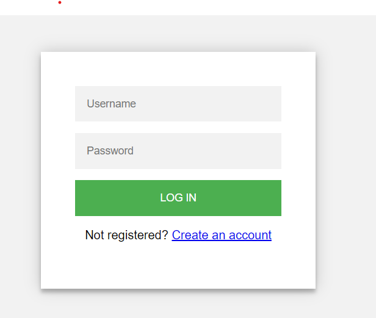

# Login Page
This is a simple HTML file that creates a login page. It includes a form where the user can input their username and password, and a button to log in. The page also includes a link for users who are not registered to create an account.

## Files Included
index.html - The main HTML file that creates the login page.

index.css - The stylesheet used to style the page.

## How to Run?

To run my application you simply need to clone the project and run the html file.

## Screenshot

